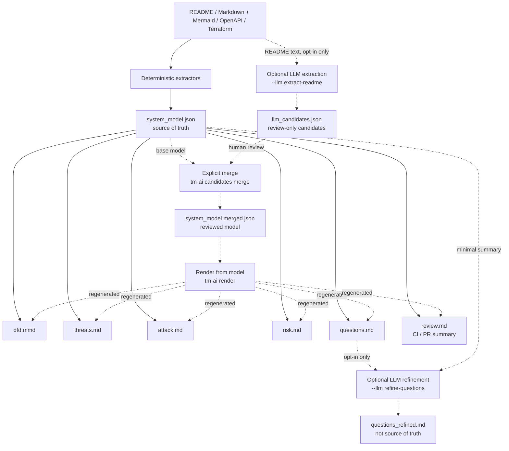

# ModelForge

Forge system understanding. Automate threat modeling.

ModelForge creates a first-draft threat model from repository artifacts. It reads
README, Markdown docs with Mermaid diagrams, OpenAPI, and Terraform files, builds a
structured `system_model.json`, then generates DFD, STRIDE, MITRE ATT&CK,
risk-priority, and clarification-question reports.

By default, ModelForge is deterministic and does not call external LLM APIs. No
API key is required unless an optional LLM mode is explicitly enabled.

## Quick Start

Requirements:

* Python 3.12+
* `uv`

Run the sample project:

```bash
git clone https://github.com/DharmaDoll/ModelForge.git
cd ModelForge
uv run tm-ai analyze ./examples/sample-system --out ./out
```

The generated files will be in `./out`.

## Analyze Your Own Project

If your project uses common filenames, ModelForge can auto-discover inputs:

```bash
uv run tm-ai analyze /path/to/your/project --out ./out
```

Auto-discovery looks for:

* `README.md` or `readme.md` in the project root
* Markdown docs with Mermaid fenced blocks under the project tree
* `openapi.yaml`, `openapi.yml`, `openapi.json`, `swagger.yaml`, `swagger.yml`, or
  `swagger.json` in the project root
* `*.tf` Terraform files recursively, excluding `.terraform`

You can also pass files explicitly:

```bash
uv run tm-ai analyze /path/to/your/project \
  --readme /path/to/your/project/README.md \
  --doc /path/to/your/project/docs/architecture.md \
  --openapi /path/to/your/project/openapi.yaml \
  --terraform /path/to/your/project/main.tf \
  --out ./out
```

Use `--terraform` more than once when a project has multiple Terraform files.
Use `--doc` more than once when a project has multiple Markdown architecture docs.

## Render Existing Model

To regenerate reports from a reviewed or merged system model without re-reading
README, OpenAPI, or Terraform inputs:

```bash
uv run tm-ai render ./out/system_model.merged.json --out ./out/reviewed
```

The input file can be named `system_model.json`, `system_model.merged.json`, or
any other path that contains a valid ModelForge system model. The output directory
receives a normalized `system_model.json` plus `dfd.mmd`, `threats.md`,
`attack.md`, `risk.md`, `questions.md`, and `review.md`.

## Execution Flow

ModelForge first turns supported inputs into `system_model.json`. Every generated
artifact reads from that model instead of raw source files.



Without `--llm`, the LLM branch is skipped and no external API is called.

## Output Files

* `system_model.json`
* `dfd.mmd`
* `threats.md`
* `attack.md`
* `risk.md`
* `questions.md`
* `review.md`
* `questions_refined.md` when optional LLM question refinement is enabled
* `llm_candidates.json` when optional LLM README extraction is enabled

What they mean:

* `system_model.json` - the structured intermediate model and source of truth
* `dfd.mmd` - Mermaid data-flow diagram
* `threats.md` - deterministic STRIDE threat candidates
* `attack.md` - deterministic MITRE ATT&CK technique candidates
* `risk.md` - deterministic High / Medium / Low review priorities
* `questions.md` - missing information to ask reviewers or system owners
* `review.md` - compact deterministic summary for CI jobs and pull requests
* `questions_refined.md` - optional LLM-refined wording for `questions.md`; not
  the source of truth
* `llm_candidates.json` - optional LLM-extracted README candidates for review;
  not merged into `system_model.json`

Model facts in `system_model.json` include non-sensitive evidence pointers such as
source file, extractor, section/detail, and line when available. Generated reports
show `Derived from` model IDs and a short evidence summary for review traceability.

Mermaid node types are inferred only from explicit label or alias keywords. Ambiguous
or unsupported Mermaid nodes remain `component`.

Mermaid `subgraph` blocks and Terraform network resources are treated as explicit
trust boundaries when the input states them. Missing entry-point boundary
membership is reported in `questions.md`; ModelForge does not infer boundaries
from names alone.

## Review Workflow

1. Run `tm-ai analyze`.
2. Review `out/system_model.json` first. It should not contain invented architecture.
3. Open `out/dfd.mmd` in a Mermaid viewer.
4. Review `out/risk.md`, then `out/threats.md`, `out/attack.md`, and `out/questions.md`.
5. Answer the questions or improve the input files, then run the command again.

Unknown information is expected. ModelForge records it as questions instead of
guessing.

## Optional LLM Refinement

LLM usage is opt-in. The default `tm-ai analyze` command never calls an external
LLM.

To refine deterministic clarification questions into a separate review artifact:

```bash
OPENAI_API_KEY=... uv run tm-ai analyze ./examples/sample-system \
  --out ./out \
  --llm refine-questions
```

This writes `questions_refined.md` in addition to the deterministic artifacts.
The source of truth remains `system_model.json` and `questions.md`. ModelForge
sends only a minimal `system_model.json` summary and deterministic question data
to the LLM, not raw input file contents. Set `MODELFORGE_LLM_MODEL` to override
the default OpenAI model.

To ask an LLM to extract structured candidates from README free text:

```bash
OPENAI_API_KEY=... uv run tm-ai analyze ./examples/sample-system \
  --out ./out \
  --llm extract-readme
```

This writes `llm_candidates.json`. These candidates are review-only and are not
merged into `system_model.json`. Unlike question refinement, this mode sends raw
README text to the LLM, so use it only for inputs that are approved for external
processing.

Recommended review flow:

```text
README
  ↓
--llm extract-readme
  ↓
llm_candidates.json
  ↓
human review
  ↓
explicit merge
  ↓
system_model.merged.json
  ↓
tm-ai render
  ↓
dfd.mmd / threats.md / attack.md / risk.md / questions.md
```

Do not treat `llm_candidates.json` as trusted input. After review, merge it
explicitly into a separate model file:

```bash
uv run tm-ai candidates merge ./out/system_model.json ./out/llm_candidates.json \
  --out ./out/system_model.merged.json
```

The merge command validates candidate schema, evidence, references, confidence,
and the final `SystemModel`. It does not overwrite deterministic model IDs.
Rejected or ambiguous candidates become review unknowns, which can then surface
as clarification questions after `tm-ai render`.

## GitHub Action

Use the repository's composite action to run deterministic threat modeling in a
consumer repository. The action auto-discovers supported inputs from `target` and
does not call an LLM or require an API key.

```yaml
name: Threat model

on:
  pull_request:

permissions:
  contents: read

jobs:
  analyze:
    runs-on: ubuntu-latest
    steps:
      - uses: actions/checkout@v7
      - id: model-forge
        uses: DharmaDoll/ModelForge@main
        with:
          target: .
          output-directory: model-forge-out
      - uses: actions/upload-artifact@v7
        with:
          name: threat-model
          path: ${{ steps.model-forge.outputs.artifact-path }}
          if-no-files-found: error
```

By default, `review.md` is also shown on the GitHub Actions job summary. The action
exposes `system-model-path` and `review-summary-path` for later validation or review
steps.

PR comments are opt-in because they require write permission. Add
`pull-requests: write` to the workflow permissions, then pass the token explicitly:

```yaml
permissions:
  contents: read
  pull-requests: write

# In the ModelForge action step:
with:
  target: .
  output-directory: model-forge-out
  pr-comment: "true"
  github-token: ${{ github.token }}
```

ModelForge creates or updates only the comment carrying its private marker. Fork
pull requests may receive a read-only token, so leave `pr-comment` disabled when
the workflow cannot grant comment permission. Pin `DharmaDoll/ModelForge` to a
release tag or commit SHA in production workflows.

The Action reports findings without failing by default. To make deterministic risk
candidates a CI gate, set `fail-on-risk` to `high`, `medium`, or `low`. The selected
rating and every higher rating will fail the Action:

```yaml
with:
  target: .
  output-directory: model-forge-out
  fail-on-risk: high
```

This gate evaluates the generated `system_model.json` with the deterministic risk
engine. It does not treat a candidate as a confirmed vulnerability; choose a
threshold only after calibrating the rules against the repository.

The same check is available locally or in custom CI workflows:

```bash
uv run tm-ai check ./model-forge-out/system_model.json --fail-on high
```

## Validation And Errors

ModelForge validates the generated graph before writing reports. Invalid references,
duplicate model IDs, blank required fields, missing inputs, and malformed OpenAPI or
Terraform files fail fast with `Error`, `Detail`, and `Hint` lines in the CLI.

## Development

```bash
uv run pytest
uv run ruff check .
uv run tm-ai analyze ./examples/sample-system --out ./out
```

The repository CI runs the same deterministic checks for pushes to `main` and pull
requests. It self-tests the composite action with the sample system, uses locked
dependencies, and uploads the result as the `sample-threat-model` workflow artifact.

Golden regression fixtures live in `tests/fixtures/golden/sample-system`. Update
them only when generated artifact changes are intentional.

## Supported Inputs

The MVP supports:

* README
* Markdown docs with Mermaid `flowchart` or `graph` fenced blocks
* OpenAPI / Swagger
* Terraform

Future versions may add Kubernetes, cloud inventory, CI/CD, source-code, SBOM, and
runtime telemetry ingestion.

## Package Layout

```text
threatmodel_ai/
  ingest/      input discovery for README, Markdown docs, OpenAPI, and Terraform
  extract/      README, Mermaid, OpenAPI, and Terraform extractors
  model/        Pydantic intermediate model, ids, merge, IO
  dfd/          Mermaid DFD renderer
  stride/       deterministic STRIDE rule engine
  attack/       deterministic MITRE ATT&CK technique mapping
  risk/         deterministic risk scoring
  questions/    clarification question generator
  llm/          optional LLM refinement interfaces
  report/       Markdown report renderers
  cli/          Typer CLI
```

## Design Philosophy

The LLM is not the source of truth. The source of truth is the intermediate model:

```text
Input Files
  ↓
Structured Extraction
  ↓
system_model.json
  ↓
DFD
  ↓
STRIDE Rules
  ↓
LLM Refinement
  ↓
Reports
```

LLM usage, when added, must be optional and limited to:

* extracting structure from unstructured text
* improving wording
* generating missing questions
* refining threat descriptions

## Security Note

This tool may process sensitive architecture and source-code information.

External LLM calls are disabled by default and require an explicit `--llm` mode.

## Threat Analysis

ModelForge currently generates deterministic threat-analysis views from the
same `system_model.json`:

* STRIDE candidates in `threats.md`
* MITRE ATT&CK Enterprise technique candidates in `attack.md`
* High / Medium / Low review priorities in `risk.md`
* A compact CI and pull-request summary in `review.md`

ATT&CK mappings are intentionally conservative. They describe plausible TTP
candidates implied by the modeled topology, not proof that an attack occurred.
