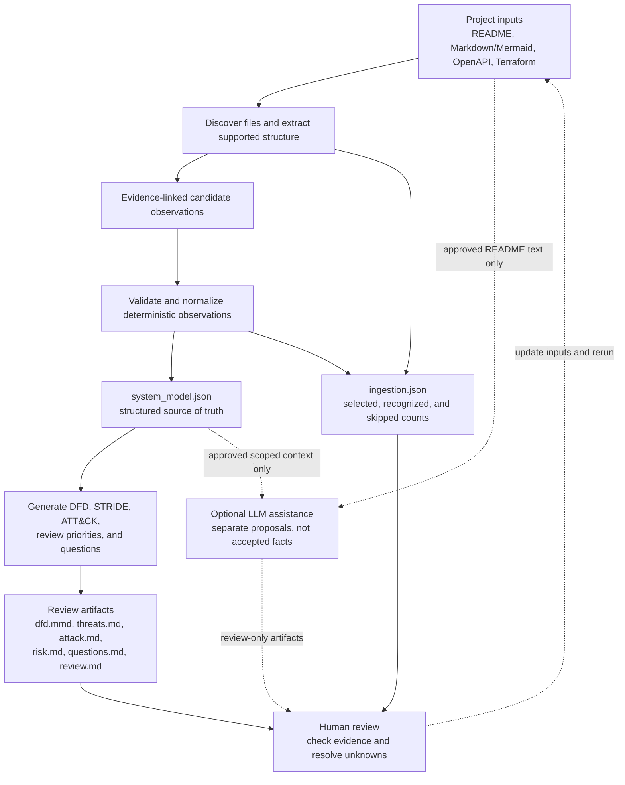
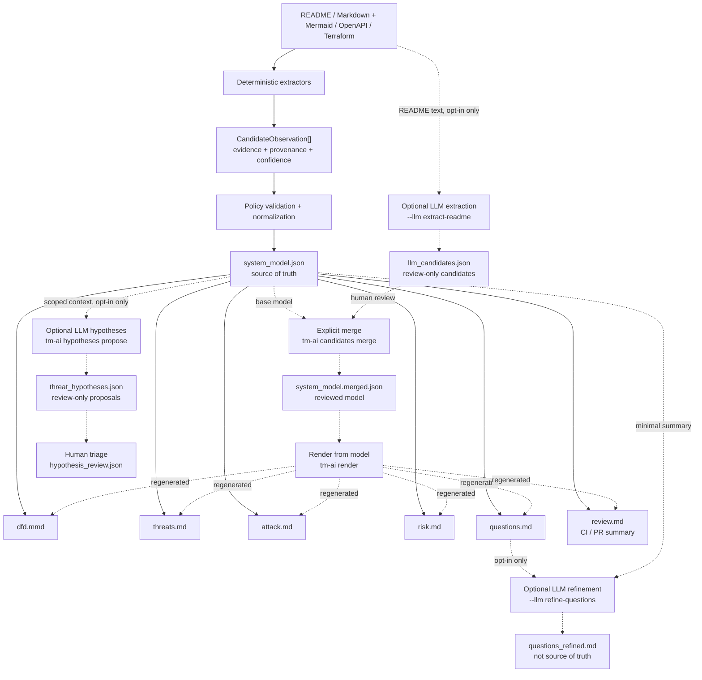
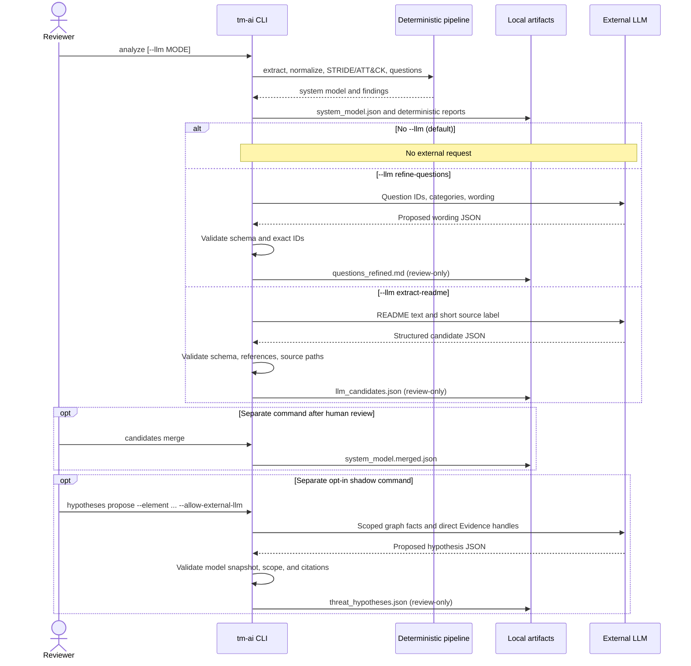

# ModelForge

Forge system understanding. Automate threat modeling.

ModelForge creates a first-draft threat model from repository artifacts. It reads
README, Markdown docs with Mermaid diagrams, OpenAPI, and Terraform files, builds a
structured `system_model.json`, then generates DFD, STRIDE, MITRE ATT&CK,
risk-priority, and clarification-question reports.

By default, ModelForge is deterministic and does not call external LLM APIs. No
API key is required unless an optional LLM mode is explicitly enabled.

## How It Works


```mermaid
flowchart TD
  Inputs["Project inputs<br/>README, Markdown/Mermaid, OpenAPI, Terraform"]
  Extract["Discover files and extract supported structure"]
  Observations["Evidence-linked candidate observations"]
  Normalize["Validate and normalize deterministic observations"]
  Model["system_model.json<br/>structured source of truth"]
  Analyze["Generate DFD, STRIDE, ATT&CK,<br/>review priorities, and questions"]
  Reports["Review artifacts<br/>dfd.mmd, threats.md, attack.md,<br/>risk.md, questions.md, review.md"]
  Diagnostics["ingestion.json<br/>selected, recognized, and skipped counts"]
  Reviewer["Human review<br/>check evidence and resolve unknowns"]
  LLM["Optional LLM assistance<br/>separate proposals, not accepted facts"]

  Inputs --> Extract --> Observations --> Normalize --> Model --> Analyze --> Reports --> Reviewer
  Extract --> Diagnostics --> Reviewer
  Normalize --> Diagnostics
  Inputs -. approved README text only .-> LLM
  Model -. approved scoped context only .-> LLM
  LLM -. review-only artifacts .-> Reviewer
  Reviewer -. update inputs and rerun .-> Inputs
```

The solid path runs locally without an LLM. Reviewers can correct source
documents or supply missing information and rerun analysis; ModelForge does not
invent unknown architecture. Optional LLM modes produce separate suggestions,
never automatic changes to the model or deterministic reports. See
[Execution Flow](#execution-flow) for the observation policy and optional merge
details.

## Quick Start

Requirements: Python 3.12+ and `uv`.

Turn the bundled payments-service example into a reviewable threat-model draft:

```bash
git clone https://github.com/DharmaDoll/ModelForge.git
cd ModelForge
uv run tm-ai analyze ./examples/sample-system --out ./out/sample-system
```

Open `out/sample-system/review.md` for the one-page summary and its linked
starting questions, then `out/sample-system/questions.md` for the grouped
review tasks and every underlying question ID and evidence pointer. The
reports are generated locally without an API key or external LLM call. They
are review candidates, not confirmed vulnerabilities.

For a guided walkthrough, sample review scenarios, and a safe way to try your
own repository, see the [Japanese Quick Start](docs/quickstart.ja.md).

## Analyze Your Own Project

If your project uses common filenames, ModelForge can auto-discover inputs:

```bash
uv run tm-ai analyze /path/to/your/project --out ./out
```

Auto-discovery looks for:

* `README.md` or `readme.md` in the project root
* `*.md` documents under the project tree; currently, only supported Mermaid
  flowchart blocks are extracted, not surrounding prose
* `openapi.yaml`, `openapi.yml`, `openapi.json`, `swagger.yaml`, `swagger.yml`, or
  `swagger.json` in the project root
* `*.tf` Terraform files recursively, excluding `.terraform`

You can also pass files explicitly:

```bash
uv run tm-ai analyze /path/to/your/project \
  --readme /path/to/your/project/README.md \
  --doc /path/to/your/project/docs/architecture.md \
  --openapi /path/to/your/project/openapi.yaml \
  --terraform /path/to/your/project/main.tf \
  --out ./out
```

Use `--terraform` more than once when a project has multiple Terraform files.
Use `--doc` more than once when a project has multiple Markdown architecture docs.

## Render Existing Model

To regenerate reports from a reviewed or merged system model without re-reading
README, OpenAPI, or Terraform inputs:

```bash
uv run tm-ai render ./out/system_model.merged.json --out ./out/reviewed
```

The input file can be named `system_model.json`, `system_model.merged.json`, or
any other path that contains a valid ModelForge system model. The output directory
receives a normalized `system_model.json` plus `dfd.mmd`, `threats.md`,
`attack.md`, `risk.md`, `questions.md`, and `review.md`.

## Execution Flow

ModelForge first turns supported inputs into `system_model.json`. Every generated
artifact reads from that model instead of raw source files.

Deterministic input adapters first emit typed `CandidateObservation` records.
Each observation carries source evidence, an explicit provenance class, a
confidence value, and one proposed model change. The normalizer currently accepts
only fully confident deterministic observations by default; generated candidates
cannot be promoted directly, and human-reviewed candidates require an explicit
normalization policy. Existing `extract_*` Python APIs remain compatible and
return the normalized `SystemModel`.

The current adapters wrap extractor-produced model claims as deterministic
observations. That transport step does not independently verify every semantic
inference. In particular, Terraform resource references are modeled as
`references`, not runtime communication or storage flows. Public exposure is
recognized only from supported explicit resource attributes; unknown controls
remain questions and do not add review-priority points as if absent.

An experimental schema 0.2 defines explicit `Inference`, per-attribute evidence,
and reviewed identity aliases. Validate either version and make a separate,
deterministic 0.2 copy of an existing 0.1 model with:

```bash
uv run tm-ai model validate ./out/system_model.json
uv run tm-ai model migrate ./out/system_model.json \
  --to 0.2 --out ./out/system_model.v0.2.json
uv run tm-ai model validate ./out/system_model.v0.2.json --check-generators
uv run tm-ai model schema --schema-version 0.2 \
  --out ./out/system_model.v0.2.schema.json
```

Migration never overwrites its input or an existing output. It moves legacy
Mermaid type guesses out of fact fields and records ambiguous legacy component
types as review unknowns. Keep the original source and reviewed 0.1 model for
comparison; migration does not verify old claims against source files.
`model schema` also supports `--schema-version 0.1` and refuses to overwrite an
existing file. Its JSON Schema checks structure, not cross-element references,
provenance policy, or other semantic rules; use `model validate` for those.
For a 0.2 model, `model validate --require-attribute-evidence` additionally
checks that each accepted element and known security-relevant attribute has a
direct Evidence pointer. It also requires direct attribute Evidence on every
known fact cited by an inference's `based_on` reference, including a Mermaid
label or alias. This stricter check is opt-in while migrated 0.1
claims are being reviewed; migration alone will not make an old model pass it.
Pointers marked `derived` alone do not satisfy the direct Evidence audit.
`--check-generators` also exercises DFD, STRIDE, ATT&CK, risk, questions, and
Markdown renderers in memory without writing reports. It checks compatibility,
not the correctness of the source claims or the quality of the generated findings.
For 0.2, the internal preview cites an applied inference ID in a candidate's
`derived_from` only when removing that inference changes the candidate. This
counterfactual check is conservative and costs additional generator passes for
each applied inference group; it is not yet a public 0.2 report format.
`analyze`, `render`, `check`, and `candidates merge` still consume or emit 0.1;
do not pass a 0.2 model to those commands yet. No LLM is used by validation or
migration.
In 0.2, an inference must cite a supported, known source claim through
`based_on`; an unknown value or a bookkeeping field such as an element ID does
not count as evidence for that inference. A valid pointer alone does not prove
that its source supports the proposed inference.


```mermaid
flowchart TD
  Inputs["README / Markdown + Mermaid / OpenAPI / Terraform"]
  Extract["Deterministic extractors"]
  Observations["CandidateObservation[]\nevidence + provenance + confidence"]
  Normalize["Policy validation + normalization"]
  Model["system_model.json\nsource of truth"]
  DFD["dfd.mmd"]
  STRIDE["threats.md"]
  ATTACK["attack.md"]
  Risk["risk.md"]
  Questions["questions.md"]
  Review["review.md\nCI / PR summary"]
  LLM["Optional LLM refinement\n--llm refine-questions"]
  Refined["questions_refined.md\nnot source of truth"]
  ExtractLLM["Optional LLM extraction\n--llm extract-readme"]
  Candidates["llm_candidates.json\nreview-only candidates"]
  Merge["Explicit merge\ntm-ai candidates merge"]
  Merged["system_model.merged.json\nreviewed model"]
  Render["Render from model\ntm-ai render"]
  Challenger["Optional LLM hypotheses\ntm-ai hypotheses propose"]
  Hypotheses["threat_hypotheses.json\nreview-only proposals"]
  Triage["Human triage\nhypothesis_review.json"]

  Inputs --> Extract --> Observations --> Normalize --> Model
  Model --> DFD
  Model --> STRIDE
  Model --> ATTACK
  Model --> Risk
  Model --> Questions
  Model --> Review
  Questions -. opt-in only .-> LLM -.-> Refined
  Model -. minimal summary .-> LLM
  Inputs -. README text, opt-in only .-> ExtractLLM -.-> Candidates
  Model -. base model .-> Merge
  Candidates -. human review .-> Merge -.-> Merged -.-> Render
  Model -. scoped context, opt-in only .-> Challenger -.-> Hypotheses -.-> Triage
  Render -. regenerated .-> DFD
  Render -. regenerated .-> STRIDE
  Render -. regenerated .-> ATTACK
  Render -. regenerated .-> Risk
  Render -. regenerated .-> Questions
  Render -. regenerated .-> Review
```

Without `--llm`, the LLM branch is skipped and no external API is called.

## Design Documents

* [Canonical Model Evolution and Review State](docs/design/canonical-model-evolution.md)
  defines the planned 0.1-to-0.2 migration, Fact/Inference boundary, Evidence
  rules, stable diff identities, and SQLite-backed review lifecycle.

## Output Files

* `system_model.json`
* `dfd.mmd`
* `threats.md`
* `attack.md`
* `risk.md`
* `questions.md`
* `review.md`
* `ingestion.json`
* `questions_refined.md` when optional LLM question refinement is enabled
* `llm_candidates.json` when optional LLM README extraction is enabled

What they mean:

* `system_model.json` - the structured intermediate model and source of truth
* `dfd.mmd` - Mermaid data-flow diagram
* `threats.md` - deterministic STRIDE threat candidates
* `attack.md` - deterministic MITRE ATT&CK technique candidates
* `risk.md` - deterministic High / Medium / Low review priorities
* `questions.md` - missing information to ask reviewers or system owners
* `review.md` - compact deterministic summary for CI jobs and pull requests
* `ingestion.json` - `analyze`-only deterministic counts of selected files,
  adapter proposals, normalized model elements, Mermaid syntax recognized or
  skipped, OpenAPI paths/HTTP operations declared or skipped, and Terraform
  resource blocks recognized or colliding by ID; it does not prove that the
  architecture is complete, and contains no source paths or file text. A
  Terraform ID collision requires manual review. Resources in different
  directories receive distinct IDs; duplicate declarations within one
  directory become an evidence-linked `model_conflict` Unknown rather than an
  accepted resource node
* `questions_refined.md` - optional LLM-refined wording for `questions.md`; not
  the source of truth
* `llm_candidates.json` - optional LLM-extracted README candidates for review;
  not merged into `system_model.json`

Model facts in `system_model.json` include evidence pointers such as
source file, extractor, section/detail, and line when available. Generated reports
show `Derived from` model IDs and a short evidence summary for review traceability.

Mermaid node types are inferred only from explicit label or alias keywords. Ambiguous
or unsupported Mermaid nodes remain `component`.

Mermaid element IDs are scoped by the Markdown path relative to the analyzed
project, diagram number, and Mermaid alias. A type or display-name change does
not change a node ID. If an explicitly supplied document lies outside the
project directory, its ID uses a location-bound fallback and may change when
that file moves. Repeated aliases in distinct documents or diagrams remain
separate; conflicting labels for one alias inside a diagram fail validation.
Python callers using `extract_mermaid_markdown` directly should pass
`identity_root=project_root` to obtain the same IDs as `tm-ai analyze`.

For models generated before this identity change, preview possible old-to-new
Mermaid ID mappings with:

```bash
tm-ai model identity-preview old/system_model.json new/system_model.json \
  --out identity-preview.json
```

The preview never edits either model or carries reviewer decisions. It lists
multiple matches as ambiguous, requiring explicit review before any future
identity-alias migration.

`review.md` separately flags nodes with the same normalized display name that
come from distinct source files. Each candidate keeps its own ID and a compact
source hint. A same-name pair is only a review suggestion, not an accepted alias;
three or more nodes are marked ambiguous. No nodes or flows are merged by this
check. In `tm-ai analyze` output, Evidence and file-list metadata for inputs
inside the analyzed project use project-relative paths; explicit inputs outside
that root retain absolute paths so their original location remains identifiable.
Existing models loaded by `render` are not rewritten. Protect model artifacts
when sharing them, especially if external files were supplied.

Mermaid `subgraph` blocks and Terraform network resources are treated as explicit
trust boundaries when the input states them. Missing entry-point boundary
membership is reported in `questions.md`; ModelForge does not infer boundaries
from names alone.

When two inputs disagree on a security-relevant field, the field is left
unknown and a `model_conflict` question carries the competing evidence. The
Terraform parser is intentionally heuristic; it does not implement full HCL
evaluation, variable resolution, or deployment reachability analysis.

## Quality Evaluation

Run the deterministic, labeled-probe evaluation with:

```bash
tm-ai evaluate tests/fixtures/evaluation/manifest.json
```

The current six cases and 61 labels are seed regression examples, not an
expert-reviewed gold standard. The command reports TP/FP/TN/FN by lens and
marks expert-reviewed coverage explicitly. See [evaluation methodology](docs/evaluation.md)
for denominator definitions, scope, and limitations.

## Review Workflow

1. Run `tm-ai analyze`.
2. Review `out/system_model.json` first. It should not contain invented architecture.
3. Open `out/dfd.mmd` in a Mermaid viewer.
4. Review `out/risk.md`, then `out/threats.md`, `out/attack.md`, and `out/questions.md`.
5. Answer the questions or improve the input files, then run the command again.

Unknown information is expected. ModelForge records it as questions instead of
guessing.

## Optional LLM Refinement

LLM usage is opt-in. The default `tm-ai analyze` command never calls an external
LLM.


```mermaid
sequenceDiagram
  actor Reviewer
  participant CLI as tm-ai CLI
  participant Rules as Deterministic pipeline
  participant Files as Local artifacts
  participant LLM as External LLM
  Reviewer->>CLI: analyze [--llm MODE]
  CLI->>Rules: extract, normalize, STRIDE/ATT&CK, questions
  Rules-->>CLI: system model and findings
  CLI->>Files: system_model.json and deterministic reports
  alt No --llm (default)
    Note over CLI,LLM: No external request
  else --llm refine-questions
    CLI->>LLM: Question IDs, categories, wording
    LLM-->>CLI: Proposed wording JSON
    CLI->>CLI: Validate schema and exact IDs
    CLI->>Files: questions_refined.md (review-only)
  else --llm extract-readme
    CLI->>LLM: README text and short source label
    LLM-->>CLI: Structured candidate JSON
    CLI->>CLI: Validate schema, references, source paths
    CLI->>Files: llm_candidates.json (review-only)
  end
  opt Separate command after human review
    Reviewer->>CLI: candidates merge
    CLI->>Files: system_model.merged.json
  end
  opt Separate opt-in shadow command
    Reviewer->>CLI: hypotheses propose --element ... --allow-external-llm
    CLI->>LLM: Scoped graph facts and direct Evidence handles
    LLM-->>CLI: Proposed hypothesis JSON
    CLI->>CLI: Validate model snapshot, scope, and citations
    CLI->>Files: threat_hypotheses.json (review-only)
  end
```

To refine deterministic clarification questions into a separate review artifact:

```bash
# Set OPENAI_API_KEY through your approved secret-management method first.
uv run tm-ai analyze ./examples/sample-system \
  --out ./out \
  --llm refine-questions
```

This writes `questions_refined.md` in addition to the deterministic artifacts.
It shows the original and proposed wording side by side for every question ID.
The source of truth remains `system_model.json` and `questions.md`. ModelForge
sends only question IDs, categories, and deterministic question text to the LLM;
it does not send the full model, evidence paths, or raw input files. The response
must match a JSON schema and preserve every question ID exactly; otherwise the
refinement fails without writing a new refined artifact. An existing artifact
from an earlier run may still be present, so check the command result before
using it. Set `MODELFORGE_LLM_MODEL` to override the default OpenAI model.

To ask an LLM to extract structured candidates from README free text:

```bash
# Set OPENAI_API_KEY through your approved secret-management method first.
uv run tm-ai analyze ./examples/sample-system \
  --out ./out \
  --llm extract-readme
```

This writes `llm_candidates.json`. These candidates are review-only and are not
merged into `system_model.json`. Unlike question refinement, this mode sends raw
README text to the LLM, so use it only for inputs that are approved for external
processing. The request uses a project-relative source label, or
`external-input/README.md` for an explicitly supplied file outside the target,
instead of sending the local absolute path. Returned source paths must match
that label. This does not anonymize the README content itself.

Recommended review flow:

```text
README
  ↓
--llm extract-readme
  ↓
llm_candidates.json
  ↓
human review
  ↓
explicit merge
  ↓
system_model.merged.json
  ↓
tm-ai render
  ↓
dfd.mmd / threats.md / attack.md / risk.md / questions.md
```

Do not treat `llm_candidates.json` as trusted input. After review, merge it
explicitly into a separate model file:

```bash
uv run tm-ai candidates merge ./out/system_model.json ./out/llm_candidates.json \
  --out ./out/system_model.merged.json
```

The merge command validates candidate schema, evidence, references, confidence,
and the final `SystemModel`. It does not overwrite deterministic model IDs.
The command currently relies on the operator to perform the stated human review;
it does not verify a separate review attestation. Do not run it as an automatic
promotion step based solely on LLM confidence.
Rejected or ambiguous candidates become review unknowns, which can then surface
as clarification questions after `tm-ai render`.

### Threat-hypothesis contract (first implementation slice)

The CLI can now export and validate the schema for a separate,
`threat_hypotheses.json` review artifact:

```bash
uv run tm-ai hypotheses schema --out ./threat_hypotheses.schema.json
uv run tm-ai hypotheses validate ./threat_hypotheses.json \
  --model ./out/system_model.json
```

This validates the artifact version, unique candidate IDs, the exact model
snapshot, affected element IDs, and direct Evidence references. Each candidate
must keep established prerequisites, assumptions, missing facts, and
verification steps separate. Evidence pointers identify sources for review;
validation cannot prove that a source actually entails a written premise.
To ask the optional challenger for hypotheses about a specific model element:

```bash
# Inspect the exact model fields that would be sent; this makes no API call.
uv run tm-ai hypotheses preview-context ./out/system_model.json \
  --element api:post:payments \
  --out ./out/challenger_context.preview.json

# Set OPENAI_API_KEY through your approved secret-management method first.
uv run tm-ai hypotheses propose ./out/system_model.json \
  --element api:post:payments \
  --classification internal-approved \
  --allow-external-llm \
  --out ./out/threat_hypotheses.json
```

Use `--classification public` only for public architecture. The classification
and `--allow-external-llm` flag are an explicit operator decision that the
selected context may leave the machine; they are not an automatic privacy
assessment. The challenger sends a one-hop graph slice around each selected
element: node IDs, names and types; edge IDs, endpoints, protocols, known
authentication/authorization values and data-asset IDs; and direct Evidence
indices. It does not send raw files, source paths, descriptions, arbitrary
metadata, or Evidence details. IDs, names and security fields may still be
confidential. The command rejects oversized scopes and existing output files.

Generated IDs are repeatable for identical proposal text and affected IDs, but
semantic rewording can change them. Invalid responses produce no new hypothesis
artifact. The proposals are not findings. List candidate IDs, then record a
human triage decision in a separate local history file:

```bash
uv run tm-ai hypotheses review-status ./out/threat_hypotheses.json \
  --model ./out/system_model.json

# Replace the example ID with one from review-status.
uv run tm-ai hypotheses decide ./out/threat_hypotheses.json \
  --model ./out/system_model.json \
  --id hypothesis:0123456789abcdef \
  --disposition needs_context \
  --reviewer your-name \
  --rationale "Ask the developer for implementation evidence" \
  --state ./out/hypothesis_review.json

uv run tm-ai hypotheses review-status ./out/threat_hypotheses.json \
  --model ./out/system_model.json \
  --state ./out/hypothesis_review.json
```

Decisions are `investigate`, `needs_context`, or `rejected`. They include a
reviewer, rationale, UTC timestamp, and prior decision events inside the state
artifact. This local history is not tamper-evident or authenticated. The state
file is bound to exact model and hypothesis-batch
fingerprints; stale decisions cannot silently carry forward. The reviewer name
is operator-supplied, not an authenticated identity. Even `investigate` means
follow-up work, not an accepted vulnerability. A finding-promotion workflow and
comparative quality evaluation are still pending. Keep this local state file
within the same confidentiality boundary as the model.

Neither generation nor validation modifies the model, deterministic reports,
or CI decisions. Schema export and validation never call an external LLM;
only `propose` does after explicit approval. Review commands are local too.

## GitHub Action

Use the repository's composite action to run deterministic threat modeling in a
consumer repository. The action auto-discovers supported inputs from `target` and
does not call an LLM or require an API key.

```yaml
name: Threat model

on:
  pull_request:

permissions:
  contents: read

jobs:
  analyze:
    runs-on: ubuntu-latest
    steps:
      - uses: actions/checkout@v7
      - id: model-forge
        uses: DharmaDoll/ModelForge@main
        with:
          target: .
          output-directory: model-forge-out
      - uses: actions/upload-artifact@v7
        with:
          name: threat-model
          path: ${{ steps.model-forge.outputs.artifact-path }}
          if-no-files-found: error
```

By default, `review.md` is also shown on the GitHub Actions job summary. The action
exposes `system-model-path` and `review-summary-path` for later validation or review
steps.

PR comments are opt-in because they require write permission. Add
`pull-requests: write` to the workflow permissions, then pass the token explicitly:

```yaml
permissions:
  contents: read
  pull-requests: write

# In the ModelForge action step:
with:
  target: .
  output-directory: model-forge-out
  pr-comment: "true"
  github-token: ${{ github.token }}
```

ModelForge creates or updates only the comment carrying its private marker. Fork
pull requests may receive a read-only token, so leave `pr-comment` disabled when
the workflow cannot grant comment permission. Pin `DharmaDoll/ModelForge` to a
release tag or commit SHA in production workflows.

The Action reports findings without failing by default. To make deterministic risk
candidates a CI gate, set `fail-on-risk` to `high`, `medium`, or `low`. The selected
rating and every higher rating will fail the Action:

```yaml
with:
  target: .
  output-directory: model-forge-out
  fail-on-risk: high
```

This gate evaluates the generated `system_model.json` with the deterministic risk
engine. It does not treat a candidate as a confirmed vulnerability; choose a
threshold only after calibrating the rules against the repository.

The same check is available locally or in custom CI workflows:

```bash
uv run tm-ai check ./model-forge-out/system_model.json --fail-on high
```

## Validation And Errors

ModelForge validates the generated graph before writing reports. Invalid references,
duplicate model IDs, blank required fields, missing inputs, and malformed OpenAPI or
Terraform files fail fast with `Error`, `Detail`, and `Hint` lines in the CLI.

## Development

```bash
uv run pytest
uv run ruff check .
uv run tm-ai analyze ./examples/sample-system --out ./out
```

The repository CI runs the same deterministic checks for pushes to `main` and pull
requests. It self-tests the composite action with the sample system, uses locked
dependencies, and uploads the result as the `sample-threat-model` workflow artifact.

Golden regression fixtures live in `tests/fixtures/golden/sample-system`. Update
them only when generated artifact changes are intentional.

## Supported Inputs

The MVP supports:

* README
* Markdown docs with Mermaid `flowchart` or `graph` fenced blocks
* OpenAPI / Swagger
* Terraform

Future versions may add Kubernetes, cloud inventory, CI/CD, source-code, SBOM, and
runtime telemetry ingestion.

## Package Layout

```text
threatmodel_ai/
  ingest/      input discovery for README, Markdown docs, OpenAPI, and Terraform
  extract/      README, Mermaid, OpenAPI, and Terraform extractors
  model/        Pydantic intermediate model, ids, merge, IO
  dfd/          Mermaid DFD renderer
  stride/       deterministic STRIDE rule engine
  attack/       deterministic MITRE ATT&CK technique mapping
  risk/         deterministic risk scoring
  questions/    clarification question generator
  llm/          optional LLM refinement interfaces
  report/       Markdown report renderers
  cli/          Typer CLI
```

## Design Philosophy

The LLM is not the source of truth. The source of truth is the intermediate model:

```text
Input Files
  ↓
Structured Extraction
  ↓
system_model.json
  ├─> deterministic DFD / STRIDE / ATT&CK ─> reports
  └─> optional LLM challenger ─> review-only hypotheses
```

LLM usage must remain optional. Permitted uses include:

* extracting structure from unstructured text
* improving wording
* generating missing questions
* refining threat descriptions
* proposing evidence-linked threat and attack-path hypotheses for human review

An LLM hypothesis is neither an architecture fact nor a confirmed vulnerability.
It must cite model elements and Evidence, expose assumptions and missing
prerequisites, and remain separate from deterministic reports and CI gates.
An opt-in shadow challenger is available for scoped model slices. Comparative
quality evaluation and an explicit human-disposition workflow remain planned.

## Security Note

This tool may process sensitive architecture and source-code information.

External LLM calls are disabled by default. They require either an explicit
`analyze --llm` mode or the approval flags on `hypotheses propose`.

## Threat Analysis

ModelForge currently generates deterministic threat-analysis views from the
same `system_model.json`:

* STRIDE candidates in `threats.md`
* MITRE ATT&CK Enterprise technique candidates in `attack.md`
* High / Medium / Low review priorities in `risk.md`
* A compact CI and pull-request summary in `review.md`

ATT&CK mappings are intentionally conservative. They describe plausible TTP
candidates implied by the modeled topology, not proof that an attack occurred.
